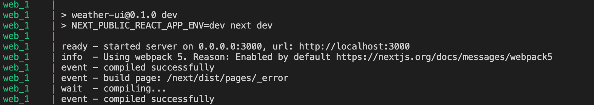

# Codespark coding challenge
This repo will contain my submission to the codespark coding challenge. Here I will be building a simple weather app to display the 5 day weather forecast.

## Project structure
This application is set up as a mono repo so the project is broken up into two main folders.

- `backend/weather`: This is the [Apollo Graphql API](https://www.apollographql.com/).
- `frontend/weather-ui`: This is the [Next.js frontend](https://nextjs.org/) application.

## Project set up

### Install dependencies
I made a simple shell script to install dependencies for the frontend and backend app. So simply run the following command.

```
./project.init.sh
```

### API key config
In the backend folder copy the `env.sample` folder into a file named `.env` and replace the `API_KEY` with your own OpenWeather key 😎

## Boot up the project

### With docker
This entire project is set up with `docker-compose` so if you have docker installed you can start up the backend and frontend using the following command 👇

```
docker-compose up --build
```

This is all configured in dev mode so the frontend will take a minute to boot up but once you see this in your terminal window 👇 everything should be ready to go. Simply visit http://localhost:3000 to see the app 🚀🤘



## Testing

Both the frontend and backend apps are linted and unit tested. These are currently running in [Github Actions](https://github.com/features/actions) but you are welcome to run them locally.

### Frontend
This project is using cypress to perform E2E UI tests. Run the following command to see it in action 👇

```
cd frontend/weather-ui
npm run test:integration
```

If you would like to explore cypress' interactive test runner you can run the following 👇

```
cd frontend/weather-ui
npm run e2e:dev
```

Finally if you would like to check for lint errors run the following 👇

```
cd frontend/weather-ui
npm run lint
```

If for some reason there were error they will self correct with prettier 👇

```
cd backend/weather
npm run lint:fix
```

### Backend
This project is using jest and [Apollo's integration testing guidelines](https://www.apollographql.com/docs/apollo-server/testing/testing/). You can run the tests using the following command 👇

```
cd backend/weather
npm run test
```

Finally if you would like to check for lint errors run the following 👇

```
cd backend/weather
npm run lint
```

If for some reason there were error they will self correct with prettier 👇

```
cd backend/weather
npm run lint:fix
```